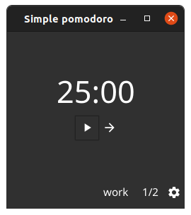

# Simple pomodoro

[](https://github.com/traefik/traefik/blob/master/LICENSE.md)
[](https://goreportcard.com/report/github.com/jozo/simple-pomodoro)


<p align="center">

</p>


**Simple pomodoro** is a cross-platform application which helps you to follow [Pomodoro](https://en.wikipedia.org/wiki/Pomodoro_Technique) time management technique.

You can set number of rounds and their duration in preferences.

## Development

### Building
```shell
make build
```

or

```shell
gofmt -s -w ./
go build -ldflags "-s -w"
```

### Sounds
https://freesfx.co.uk

### Create Resources
```shell
fyne bundle -package main -name alarmSound "sounds/Electronic Beeping Alarm Clock.wav" > sounds.go
```

### Packaging on MacOS
_Note_: I changed SendNotification in app_darwin.go from fyne to:
```go
template := `display notification "%s" with title "%s" sound name "default"`
```
